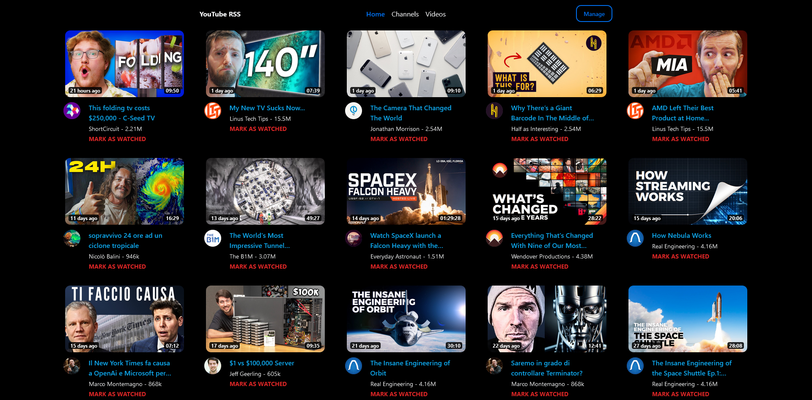

# YouTube-RSS

## Description

This service is an alternative to YouTube's subscription page. You can decide which videos you want to keep and which videos you want to remove, giving you a list of content you want to watch.



## Requirements

To get started, you will need to create a Google Cloud account, create a project, enable the `YouTube Data API v3` and generate a key.

## Installation

1. Download the `docker-compose.yml` file in the folder you want to use

    ```shell
    wget https://raw.githubusercontent.com/M4RC02U1F4A4/YouTube-RSS/main/docker-compose.yml
    ```

2. Edit the environment variable in the `docker-compose.yml` file
3. Deploy the application

    ```
    docker compose up -d
    ```
4. You can now access the service on `http://127.0.0.1:8080`