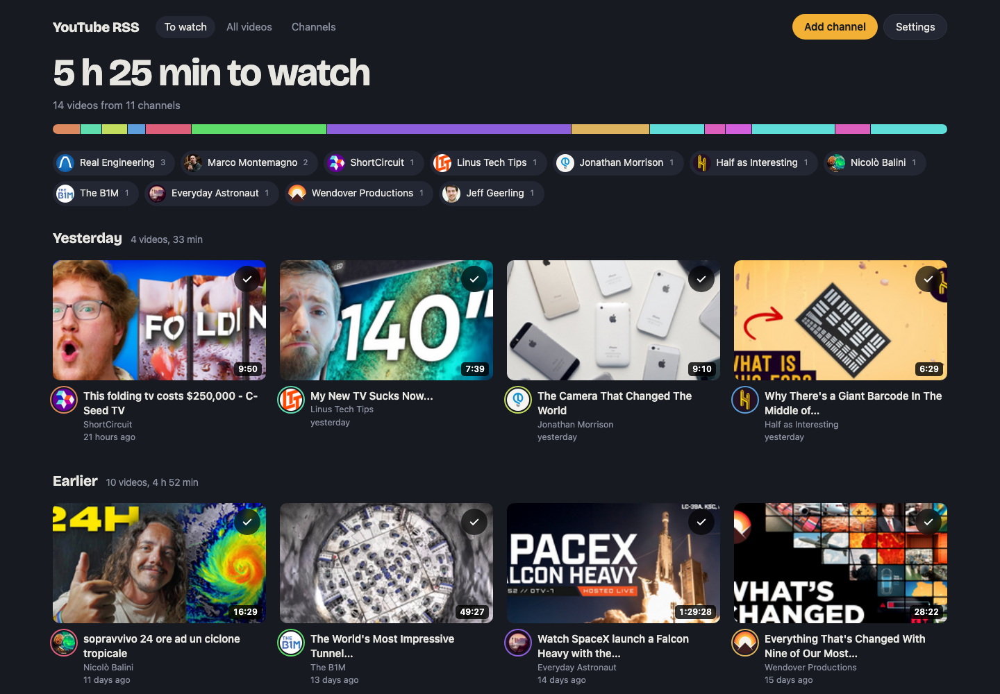

# YouTube-RSS

## Description

This service is an alternative to YouTube's subscription page. You can decide which videos you want to keep and which videos you want to remove, giving you a list of content you want to watch.



## Requirements

To get started, you will need to create a Google Cloud account, create a project, enable the `YouTube Data API v3` and generate a key.

## Installation

1. Download the `docker-compose.yml` file in the folder you want to use

    ```shell
    wget https://raw.githubusercontent.com/M4RC02U1F4A4/YouTube-RSS/main/docker-compose.yml
    ```

2. Set your API key in `G_API_KEY` in the `docker-compose.yml` file
3. Deploy the application

    ```
    docker compose up -d
    ```
4. You can now access the service on `http://127.0.0.1:8080`

## Scheduled jobs

The app does not schedule anything by itself: the `updater` service in `docker-compose.yml` calls these endpoints with cron.

| Endpoint | Schedule | What it does |
|---|---|---|
| `GET /update/videos` | every hour | Imports new videos from the channels' RSS feeds |
| `GET /update/channels` | once a day | Refreshes channel names, logos and counters |
| `GET /clean/videos` | once a day | Deletes videos watched more than 30 days ago |

On Kubernetes you can drop the `updater` and use a CronJob per endpoint instead, for example:

```yaml
apiVersion: batch/v1
kind: CronJob
metadata:
  name: ytrss-update-videos
spec:
  schedule: "0 * * * *"
  jobTemplate:
    spec:
      template:
        spec:
          restartPolicy: OnFailure
          containers:
            - name: update
              image: alpine
              command: ["wget", "-q", "-O", "-", "http://ytrss:8080/update/videos"]
```

Each `/update` call uses YouTube API quota, so avoid running them much more often than this.

## Development

The UI is a single static page, `app/static/index.html`, served by the Flask app together with the API. There is no build step.

To run the API checks you need a throwaway MongoDB:

```shell
docker run -d --rm -p 27017:27017 --name ytrss-test mongo
cd app && pip install -r requirements.txt
MONGODB_HOST=localhost MONGODB_PORT=27017 python test_main.py
```
